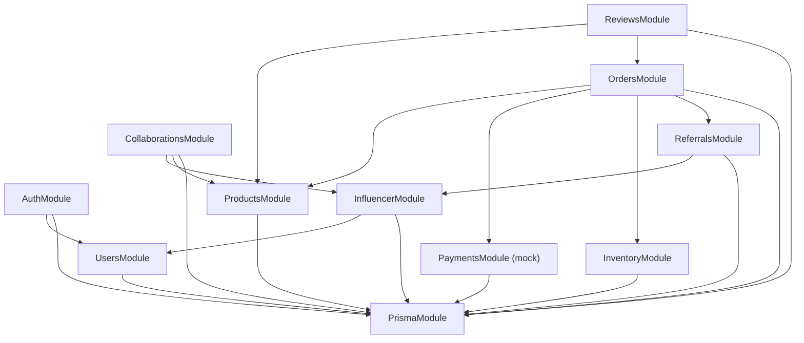

# Component Dependencies (축소판)

## Dependency Diagram

## Dependency Matrix

| Module | Depends On |
|---|---|
| AuthModule | UsersModule, PrismaModule |
| UsersModule | PrismaModule |
| ProductsModule | PrismaModule |
| OrdersModule | ProductsModule, PaymentsModule, InventoryModule, ReferralsModule, PrismaModule |
| InventoryModule | PrismaModule |
| PaymentsModule (mock) | PrismaModule |
| ReviewsModule | ProductsModule, OrdersModule, PrismaModule |
| InfluencerModule | UsersModule, PrismaModule |
| CollaborationsModule | InfluencerModule, ProductsModule, PrismaModule |
| ReferralsModule | InfluencerModule, PrismaModule |
| PrismaModule | (독립, 기반 모듈) |

## RBAC 매트릭스

| 기능 | Customer | Admin-A | Admin-B | Influencer | Public |
|---|---|---|---|---|---|
| 상품 조회 | — | — | — | — | ✅ |
| 상품 CRUD | ❌ | ✅ | ✅ | ❌ | ❌ |
| 주문 (본인) | ✅ | ✅ | ✅ | ❌ | ❌ |
| 주문 (전체) | ❌ | ✅ | ✅ | ❌ | ❌ |
| 재고 조회 | ❌ | ✅ | ✅ | ❌ | ❌ |
| 리뷰 작성 | ✅ | ❌ | ❌ | ❌ | ❌ |
| 리뷰 삭제 | ❌ | ✅ | ✅ | ❌ | ❌ |
| 인플루언서 프로필 | ❌ | ✅ | ✅ | ✅(own) | ❌ |
| 협업 제안 | ❌ | ✅ | ✅ | ❌ | ❌ |
| 레퍼럴 생성 | ❌ | ❌ | ❌ | ✅ | ❌ |
| 커미션 조회 | ❌ | ✅ | ❌ | ✅(own) | ❌ |
| Admin 관리 | ❌ | ✅ | ❌ | ❌ | ❌ |
