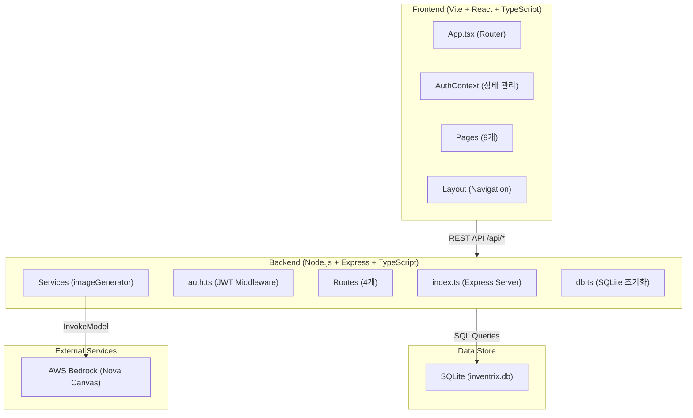
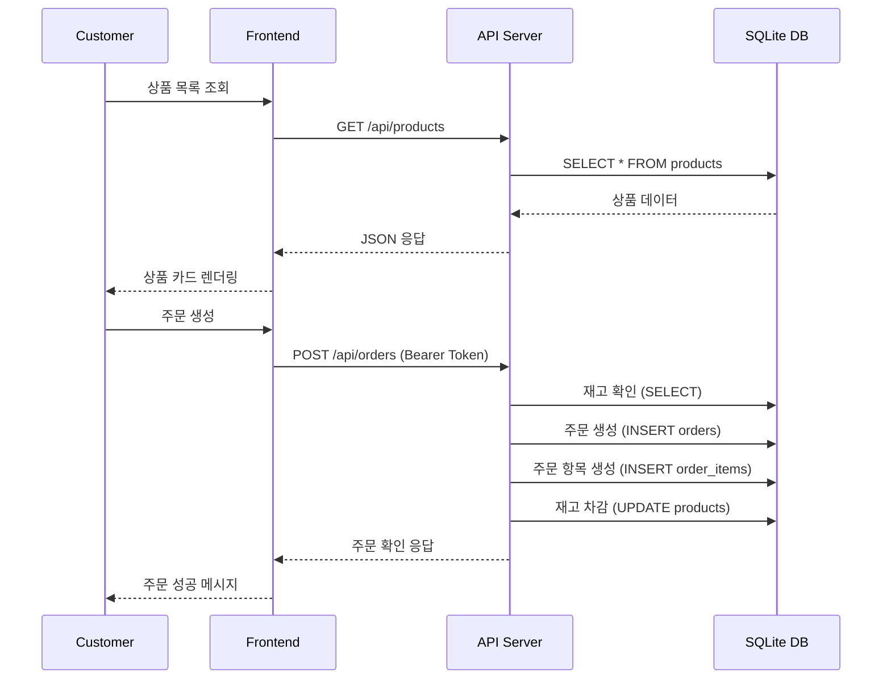

# System Architecture

## System Overview
Inventrix는 pnpm monorepo 기반의 2-tier 웹 애플리케이션이다. React SPA frontend가 Express REST API backend와 통신하며, SQLite 파일 기반 데이터베이스를 사용한다. AI 이미지 생성을 위해 AWS Bedrock (Amazon Nova Canvas)을 외부 서비스로 활용한다.

## Architecture Diagram



### Text Alternative
```
Frontend (Vite + React + TypeScript)
  --> REST API /api/* --> Backend (Node.js + Express + TypeScript)
    --> SQL Queries --> SQLite (inventrix.db)
    --> InvokeModel --> AWS Bedrock (Nova Canvas)
```

## Component Descriptions

### Frontend (packages/frontend)
- **Purpose**: 고객 및 관리자 웹 인터페이스
- **Responsibilities**: SPA 라우팅, 인증 상태 관리, API 호출, UI 렌더링
- **Dependencies**: React, React Router DOM, Vite
- **Type**: Application

### Backend API (packages/api)
- **Purpose**: REST API 서버 및 비즈니스 로직
- **Responsibilities**: 인증/인가, CRUD 연산, 주문 처리, 분석 집계, 이미지 생성
- **Dependencies**: Express, better-sqlite3, bcrypt, jsonwebtoken, AWS SDK
- **Type**: Application

## Data Flow



## Integration Points
- **External APIs**: AWS Bedrock (Amazon Nova Canvas v1) - AI 상품 이미지 생성
- **Databases**: SQLite (inventrix.db) - 모든 데이터 저장 (users, products, orders, order_items)
- **Third-party Services**: 없음 (결제, 배송 등 미통합)

## Infrastructure Components
- **CDK Stacks**: 없음
- **Deployment Model**: deploy.sh 스크립트 기반 AWS 배포 (EC2 추정)
- **Networking**: 별도 VPC/보안 그룹 설정 없음 (단일 서버)
