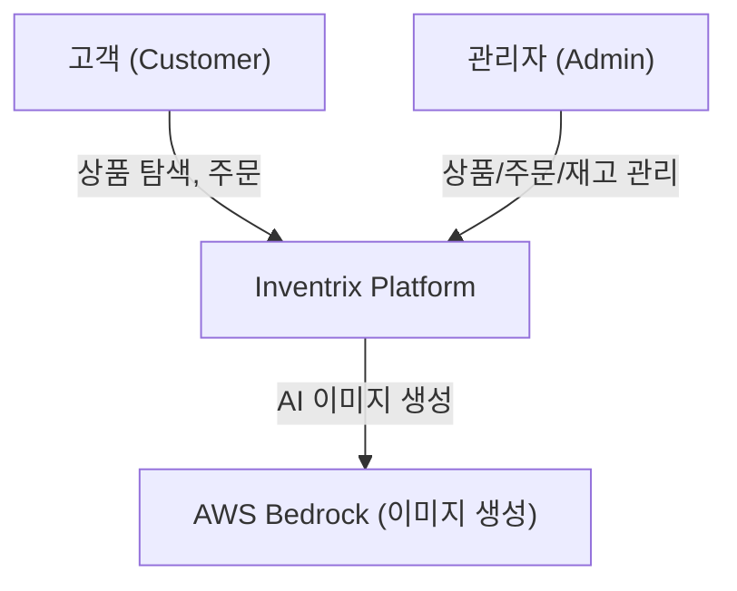

# Business Overview

## Business Context Diagram



### Text Alternative
```
고객 (Customer) --> Inventrix Platform (상품 탐색, 주문)
관리자 (Admin) --> Inventrix Platform (상품/주문/재고 관리)
Inventrix Platform --> AWS Bedrock (AI 이미지 생성)
```

## Business Description
- **Business Description**: Inventrix는 전자제품 중심의 full-stack e-commerce 플랫폼으로, 가상 상점(storefront), 상품 카탈로그 관리, 주문 처리, 재고 관리, 비즈니스 분석 기능을 제공한다.
- **Business Transactions**:
  1. **상품 탐색 (Product Browsing)**: 고객이 상품 목록을 조회하고 상세 정보를 확인
  2. **주문 생성 (Order Placement)**: 고객이 상품을 선택하고 수량을 지정하여 주문 (재고 자동 차감, GST 10% 자동 계산)
  3. **주문 관리 (Order Management)**: 관리자가 주문 상태를 변경 (pending → processing → shipped → delivered / cancelled)
  4. **상품 관리 (Product Management)**: 관리자가 상품 CRUD 수행 및 AI 이미지 생성
  5. **재고 모니터링 (Inventory Monitoring)**: 관리자가 재고 수준 확인 (in_stock / low_stock / out_of_stock)
  6. **비즈니스 분석 (Analytics)**: 관리자가 매출, 주문 수, 인기 상품, 재고 현황 대시보드 조회
  7. **사용자 인증 (Authentication)**: 로그인/회원가입, JWT 기반 인증, 역할 기반 접근 제어

- **Business Dictionary**:
  - **GST**: Goods and Services Tax (10% 세금)
  - **Low Stock**: 재고 10개 미만
  - **Out of Stock**: 재고 0개
  - **Storefront**: 고객 대상 상품 진열 페이지

## Component Level Business Descriptions

### API (packages/api)
- **Purpose**: 모든 비즈니스 로직을 처리하는 백엔드 서버
- **Responsibilities**: 사용자 인증, 상품 CRUD, 주문 처리 및 재고 차감, 분석 데이터 집계, AI 이미지 생성

### Frontend (packages/frontend)
- **Purpose**: 고객 및 관리자를 위한 웹 인터페이스
- **Responsibilities**: 상품 탐색 UI, 주문 UI, 관리자 대시보드, 상품/주문/재고 관리 UI
