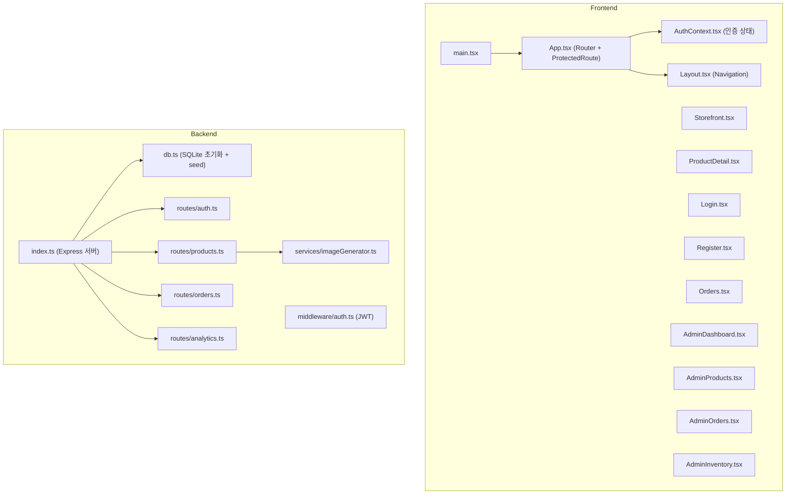

# Code Structure

## Build System
- **Type**: pnpm (monorepo with workspaces)
- **Configuration**:
  - Root: `package.json` + `pnpm-workspace.yaml` (packages/*)
  - API: `tsx watch` (dev), `tsc` (build)
  - Frontend: `vite` (dev), `tsc && vite build` (build)

## Key Classes/Modules

### Existing Files Inventory

**Backend (packages/api/src/)**:
- `index.ts` - Express 서버 초기화, 미들웨어 설정, 라우트 등록
- `db.ts` - SQLite 데이터베이스 초기화, 테이블 생성, 시드 데이터 삽입
- `middleware/auth.ts` - JWT 인증/인가 미들웨어 (authenticate, requireAdmin, generateToken)
- `routes/auth.ts` - 로그인/회원가입 엔드포인트
- `routes/products.ts` - 상품 CRUD + AI 이미지 생성 엔드포인트
- `routes/orders.ts` - 주문 생성/조회/상태 변경 엔드포인트
- `routes/analytics.ts` - 대시보드 분석 + 재고 현황 엔드포인트
- `services/imageGenerator.ts` - AWS Bedrock 기반 AI 이미지 생성 서비스

**Frontend (packages/frontend/src/)**:
- `main.tsx` - React 앱 진입점
- `App.tsx` - 라우터 설정, ProtectedRoute 컴포넌트
- `index.css` - 글로벌 스타일 (gradient 배경, 버튼/입력 스타일)
- `context/AuthContext.tsx` - 인증 상태 관리 (login, register, logout)
- `components/Layout.tsx` - 네비게이션 바 + Outlet 레이아웃
- `pages/Login.tsx` - 로그인 폼
- `pages/Register.tsx` - 회원가입 폼
- `pages/Storefront.tsx` - 상품 목록 (그리드 카드 레이아웃)
- `pages/ProductDetail.tsx` - 상품 상세 + 주문 기능
- `pages/Orders.tsx` - 고객 주문 내역
- `pages/AdminDashboard.tsx` - 관리자 대시보드 (매출, 주문, 인기 상품)
- `pages/AdminProducts.tsx` - 상품 관리 (CRUD + AI 이미지 생성)
- `pages/AdminOrders.tsx` - 주문 관리 (상태 변경)
- `pages/AdminInventory.tsx` - 재고 현황 테이블

## Design Patterns

### Repository Pattern (Implicit)
- **Location**: `db.ts` + 각 route 파일
- **Purpose**: 데이터 접근 추상화 (현재는 route에서 직접 SQL 실행)
- **Implementation**: better-sqlite3 prepared statements 직접 사용

### Context Pattern (React)
- **Location**: `context/AuthContext.tsx`
- **Purpose**: 전역 인증 상태 관리
- **Implementation**: React Context API + localStorage 기반 토큰 저장

### Protected Route Pattern
- **Location**: `App.tsx`
- **Purpose**: 인증/인가 기반 라우트 보호
- **Implementation**: ProtectedRoute 컴포넌트 (adminOnly 옵션)

## Critical Dependencies

### better-sqlite3 (v9.2.2)
- **Usage**: 모든 데이터 저장 및 조회
- **Purpose**: 동기식 SQLite 드라이버

### jsonwebtoken (v9.0.2)
- **Usage**: 인증 토큰 생성/검증
- **Purpose**: JWT 기반 stateless 인증

### bcrypt (v5.1.1)
- **Usage**: 비밀번호 해싱
- **Purpose**: 안전한 비밀번호 저장

### @aws-sdk/client-bedrock-runtime (v3.700.0)
- **Usage**: AI 이미지 생성
- **Purpose**: Amazon Nova Canvas 모델 호출

### react-router-dom (v6.21.1)
- **Usage**: SPA 라우팅
- **Purpose**: 클라이언트 사이드 네비게이션
