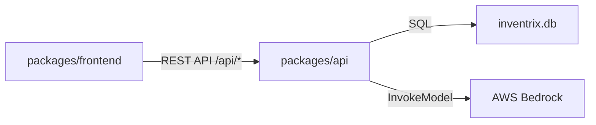

# Dependencies

## Internal Dependencies

### Frontend depends on API
- **Type**: Runtime (HTTP)
- **Reason**: 모든 데이터 조회/변경은 REST API를 통해 수행

### API depends on SQLite
- **Type**: Runtime (File I/O)
- **Reason**: 모든 데이터 영속화

### API depends on AWS Bedrock
- **Type**: Runtime (HTTP/SDK)
- **Reason**: AI 상품 이미지 생성 (선택적 기능)

## External Dependencies

### Backend (packages/api)

| 패키지 | 버전 | 용도 | 라이선스 |
|---|---|---|---|
| express | ^4.18.2 | HTTP 서버 | MIT |
| better-sqlite3 | ^9.2.2 | SQLite 드라이버 | MIT |
| bcrypt | ^5.1.1 | 비밀번호 해싱 | MIT |
| jsonwebtoken | ^9.0.2 | JWT 인증 | MIT |
| cors | ^2.8.5 | CORS 미들웨어 | MIT |
| @aws-sdk/client-bedrock-runtime | ^3.700.0 | AWS Bedrock SDK | Apache-2.0 |

### Frontend (packages/frontend)

| 패키지 | 버전 | 용도 | 라이선스 |
|---|---|---|---|
| react | ^18.2.0 | UI 라이브러리 | MIT |
| react-dom | ^18.2.0 | DOM 렌더링 | MIT |
| react-router-dom | ^6.21.1 | SPA 라우팅 | MIT |
